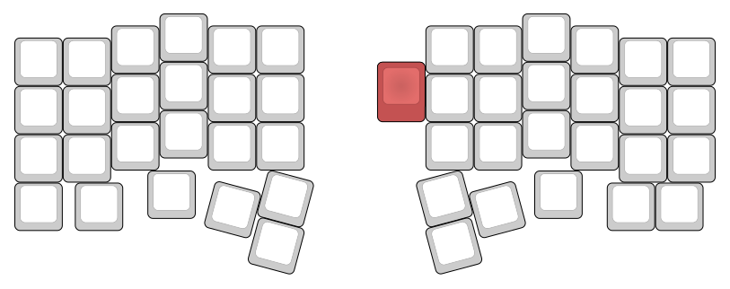

The Jade keyboard is a split 40% ortholinear mechanical keyboard (*that's a lot of words*) which
(optionally) has a thinkpad trackpoint attachment on the right half.

> **WARNING**: THIS IS STILL IN DEVELOPMENT AND MIGHT BE COMPLETELY UNUSABLE



The red key represents the trackpoint [keyboard-layout-editor](http://www.keyboard-layout-editor.com/##@@_x:3&p=OEM&a:7%3B&=E&_x:6.5%3B&=I%3B&@_y:-0.75&x:2%3B&=W&_x:1%3B&=R&=T&_x:2.5%3B&=Y&=U&_x:1%3B&=O%3B&@_y:-0.75%3B&=&=Q&_x:10.5%3B&=P&=%3B&@_y:-0.5&x:3%3B&=D&_x:3.5&c=%23c45252&p=DSA&h2:1.25&l:true%3B&=&_x:2&c=%23cccccc&p=OEM%3B&=K%3B&@_y:-0.75&x:2%3B&=S&_x:1&n:true%3B&=F&=G&_x:2.5%3B&=H&_n:true%3B&=J&_x:1%3B&=L%3B&@_y:-0.75%3B&=&=A&_x:10.5%3B&=%5B&=%5D%3B&@_y:-0.5&x:3%3B&=C&_x:6.5%3B&=,%3B&@_y:-0.75&x:2%3B&=X&_x:1%3B&=V&=B&_x:2.5%3B&=N&=M&_x:1%3B&=.%3B&@_y:-0.75%3B&=&=Z&_x:10.5%3B&=-&=%3B&@_y:-0.25&x:2.75%3B&=&_x:7%3B&=%3B&@_y:-0.75%3B&=&_x:0.25%3B&=&_x:10%3B&=&=%3B&@_r:15&rx:7.25&ry:3.5&y:0.25&x:-2%3B&=%3B&@_y:-0.5&x:-3%3B&=%3B&@_ry:3.75&y:1&x:-2%3B&=%3B&@_r:-15&ry:3.5&y:0.25&x:1%3B&=%3B&@_y:-0.5&x:2%3B&=%3B&@_ry:3.75&y:1&x:1%3B&=)

**TODO**: add pictures here

The whole project is based on the [corne keyboard](https://github.com/foostan/crkbd) by foostan but
has undergone many modifications. Still, a lot of work has been saved duo to the work done
by foostan.

The main differences between the corne and the jade are that:
- corne has 4 less keys (44 vs 48; jade has a bottom row and thumb cluster while the corne only has
  a thumb cluster)
- corne is (depending on the model) reversible; the jade uses kailh hot-swap sockets which are also
  supported by the corne-cherry version (which is also not reversible)
- corne has more case options available, the jade currently only has "pcb case"

## Getting the keyboard

The current method to getting a jade keyboard is letting it be manufactured by jlcpcb, pcbway or a
different pcb manufacturer. There are no kits available.

> Almost all pcb manufacturers have a minimum order quantity of 5pc; getting 5 times the pieces you
> need might still be cheaper than some other keyboard kits and you can possibly resell them.

The keyboard comes in 3 different parts: the pcb, the bottom plate and the top plate.

## Building and needed components

You mainly need kailh hot-swap sockets, screws, LEDs and ProMicro's

The full list can be found [here](/components.md) along with some cost estimates.

Build instructions can be found [here](/build-instructions.md).

## Modifying the keyboard

The keyboard was designed in [KiCad](https://https://kicad-pcb.org/) and uses some of
[foostan's footprints / symbols](https://github.com/foostan/kbd) for custom keyboards, as well as a few
standard KiCad libraries (power & led).

These should be directly available when cloning the repo **with submodules**. This can be done by
using

```sh
git clone --recursive [url]
```

when cloning the repo initially or later on using

```sh
git submodule update --init --recursive
```

A few beginner mistakes I made / faced are:
- not working with eeschema and jumping straight into pcbnew (the pcb designer)
- not caring about aligning things to the grid (KiCad really likes it's grid)

Make sure that the paths for the additional symbols and footprints are configured correctly. It should
look something like this:

footprints: 

| nickname | library path                                    |
| -------- | ----------------------------------------------- |
| kbd      | `${KIPRJMOD}/kbd/kicad-footprints/kbd.pretty`   |
| logo     | `${KIPRJMOD}/../logo-footprints`                |

symbols:

| nickname | library path                                    |
| -------- | ----------------------------------------------- |
| kbd      | `${KIPRJMOD}/kbd/kicad-symbols/kbd.lib`         |
| power    | `${KIPRJMOD}/libraries/kicad-symbols/power.lib` |
| LED      | `${KIPRJMOD}/libraries/kicad-symbols/LED.lib`   |

When using KiCad 5.1.6 the pick and place file (also called .pos file) might be incorrect. Using
later versions will probably fix this as well as prior versions as this is a bug that was introduced
while fixing another bug.

Incase you are using KiCad 5.1.6 the error is easy to correct: the x-coordinate in the (csv) file is
simply flipped. Just flip it back and you are fine.

If you are using JLCPCB for manufacturing you can use their preview while ordering to check that everything
is alright. 

> Modifying the PCB can require also modifying the bottom- and top-plate.
